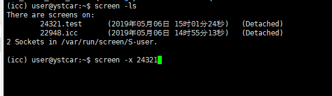

# Mac

## 文件操作相关指令

| 指令 | 说明 |
| --- | --- |
| mkdir ** | 新建文件夹 |
| touch ** | 新建文件 |
| echo ** > ** | 新增内容到某个文件 |
| cp ** ** | 复制某个文件到某个目录（scp跨服务器复制） |
| cp -r ** ** | 复制某个文件夹到某个目录 |
| mv ** ** | 移动某个文件(夹)到某个目录 |
> sz（下载）、rz（上传）、cp ***.js{,.bak}（备份）

## iterm 使用
* 快捷命令

| 指令 | 说明 |
| --- | --- |
| command+D | 右侧分屏 |
| command+shift+D | 上下分屏 |
| control+U | 清空当前行 |

* [额外配置](https://www.cnblogs.com/diyxiaoshitou/p/9017413.html)

## screen操作
* screen -S +screen名字（创建一个screen）
* screen -ls
* screen -x +进程号（进入某个screen）
* ctrl + a + d（出去）

## 其他
command+shift+G -> 前往文件夹（没权限就sudo）